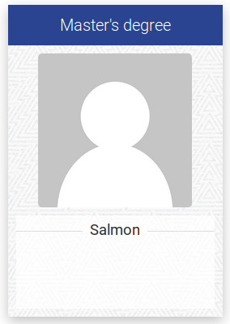
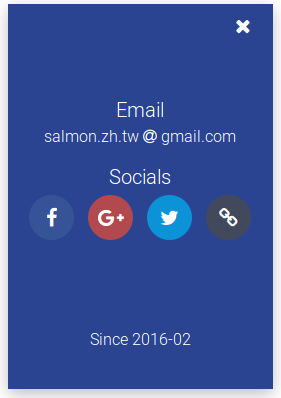
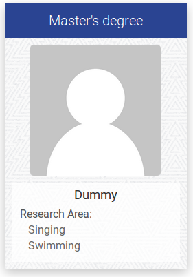
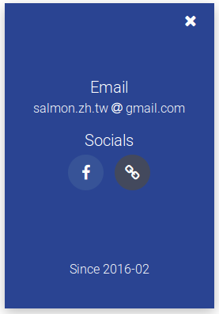

This is the website generator for NTUST GAME Lab.

This project has finish layout, like **JavaScript**, **CSS**. You just need to modify the `json data` to re-render the HTML to be your website for workspace.

Written by Ze-Hao, Wang ([http://salmon.tw](http://salmon.tw))

---

## Environment

* Node.js v4.4.7 LTS or above


## Dependencies

* jade v1.11.0 (has renamed to **pug**)
* ncp v2.0.0
* rimraf v2.5.2


## Steps

### 0. Enter the project folder.

```shell
$ cd ./lab-website
```

### 1. Set the info of website.

```shell
$ vim ./program/import/info.json
```

### 2. Set the members' info.

```shell
$ vim ./program/import/members.json
```

### 3. Publish the web pages.

```shell
# Render the web pages.
$ node ./program/src/generator.js

# Web pages can be found in './output'
$ cd ./output
$ cp -R ./ <where you want to paste>
```


## JSON data format in `info.json`

All the informations are important. Please don't remove anyone. 

```json
{
	"title": "Graphics Animation Multimedia Edutainment Lab @ NTUST",
	"introduction": "content here ...",
	"contact":
		{
			"school":     "國立台灣科技大學",
			"department": "資訊工程學系",
			"address":    "106 台北市大安區基隆路四段四十三號",
			"room":       "（工程一館 E1-201-2 室）",
			"telephone":  "886-2-2733-1080 #7928"
		},
	"copyright": "2015 - 2016 © Graphics Animation Multimedia Edutainment Laboratory"
}
```


## JSON data format in `members.json`

Member object fits in `faculty`, `graduate`, `ungraduate` and `alumni`. Please follow the format below.

* **studentId** (Optional)
* **name**
* **title**
* **since** (Optional)
* **mail** (Optional)
* **thumbnail** (Optional)
* **domains** (Optional. Students can fill to 2 data, faculty can fill 4 data.)
* **socials** (Optional)
	* facebook, google, twitter and website

<p align="center">
  
  &nbsp;&nbsp;
  
</p>

```json
{
	"faculty": [
		{}
	],
	"graduate": [
		{
			"studentId": "M10427000",
			"name":      "Salmon",
			"title":     "Master's degree",
			"since":     "2016-02",
			"mail":      "salmon.zh.tw@gmail.com",
			"thumbnail": "./",
			"domains":   ["Singing", "Swimming"],
			"socials":   {
				"facebook": "#",
				"google": "#",
				"twitter": "#",
				"website": "http://salmon.tw"
			}
		},
		{}, {}
	],
	"ungraduate": [
		{}, {}
	],
	"alumni": [
		{}, {}
	]
}
```

### Ingore info

Any optionals info that you wanna ingore. You can delete the pair of social object.

<p align="center">
  
  &nbsp;&nbsp;
  
</p>

```json
{
	"name":      "Salmon",
	"title":     "Master's degree",
	"since":     "2016-02",
	"mail":      "salmon.zh.tw@gmail.com",
	"thumbnail": "./",
	"socials":   {
		"facebook": "#",
		"website": "http://salmon.tw"
	}
}
```

## Social metadata

Please find `./program/views/index.jade` and fix it in `<head>` tag.

## Google Analytics

If you want to use your `ga.js`, please find `./program/views/components/ga.js` and fix it. If you want to stop it, please clean the text in file.